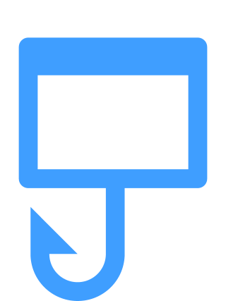

  

<h1 align="use-el-dialog">Floating Vue</h1>

  <!-- <a href="https://www.npmjs.com/package/use-el-dialog"> -->
   

use el-dialog by hook type through <a href="https://github.com/HuziG/use-el-dialog">use-el-dialog</a>

  <a href="https://use-el-dialog.vercel.app/"><b>📚️ Documentation</b></a>

This package is provide a hook type to use [el-dialog](https://element-plus.org/en-US/component/dialog.html#dialog) component. Before use this package, you should install [element-plus](https://element-plus.org/en-US/component/installation) first. Look out! Your Vue version should be 3.x.

| use-el-dialog | element plus | Vue compatibility |
| ------------ | ------- | ----------------- |
| 1.x          | 1.x  | 3.x               |
